## AppCenter App Template

### Base app template with Covalent UI & Ecosystem Services APIs

## Setup

* Ensure you have **Node 6.12.0** (on a Mac use Homebrew and `brew install node@6.12.0`)
* Ensure you have **NPM 3+** installed.
* Install Docker Engine: [https://docs.docker.com/engine/installation/](https://docs.docker.com/engine/installation/)
* Install Angular CLI `npm i -g @angular/cli`
* Install Typescript `npm i -g typescript`
* Install TSLint `npm i -g tslint`
* Install Protractor for e2e testing `npm i -g protractor`
* Install Node packages `npm i`


---

## Development

#### Develop locally without Docker

* Run local webserver `npm run serve`
* In Chrome go to [http://localhost:4200](http://localhost:4200)

---

#### Building/Deploying to Docker

1. Edit `build.conf.js` and change the values as needed

```
    deploymentServer: 'nginx', // can be 'nginx' or 'nodejs'
    imageName: '<username>/appcenter-app-covalent',
    tag: 'mytag',
    repository: 'quay.ac.uda.io'
```
Notice you must change the \<username\> above in `imageName`

`deploymentServer` defaults to nginx which is much smaller. Use nodejs if you want to write backend code serverside

##### Build and Push to Docker Repository

1. Run command: `npm run docker:push`

If you encounter the following error when running this command:
```
Error: Command failed: docker push quay.ac.uda.io/<username>/appcenter-app-covalent:mytag
unauthorized: access to the requested resource is not authorized
```
Then run the following command `docker login quay.ac.uda.io`

2. Login to the website of the repository you used above, for example: [https://quay.ac.uda.io/](https://quay.ac.uda.io/)

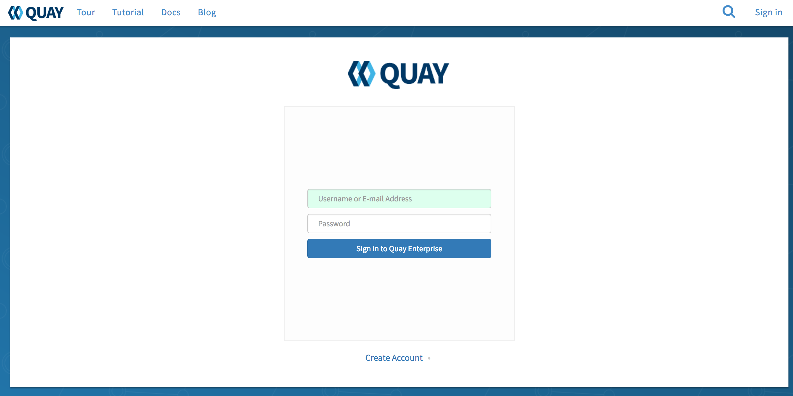

3. After logging in your container will be listed

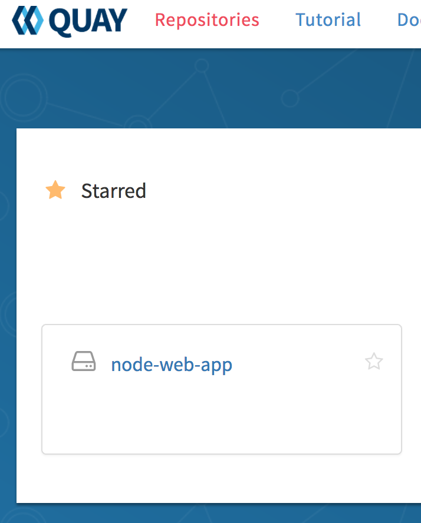

4. To make the container publicly accessible:

   a. Click on your container name

   b. Click on Settings (in the left nav icons)

   c. Click on the "Make Public" button under Repository Visibility

---

#### Run Docker in AppCenter

1. Login into an AppCenter Server

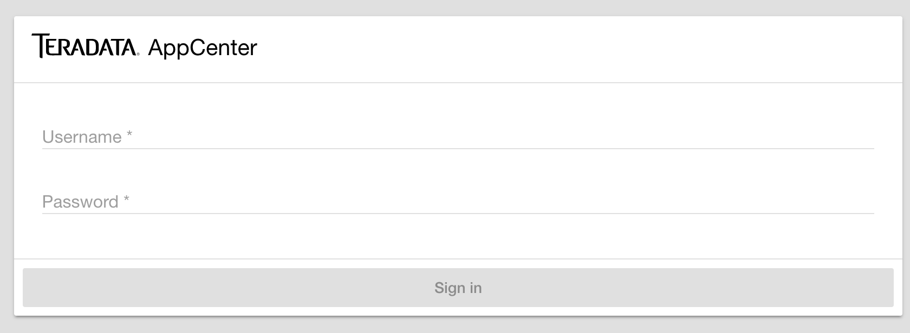

2. Go to the top left hamburger menu and click on `Develop`

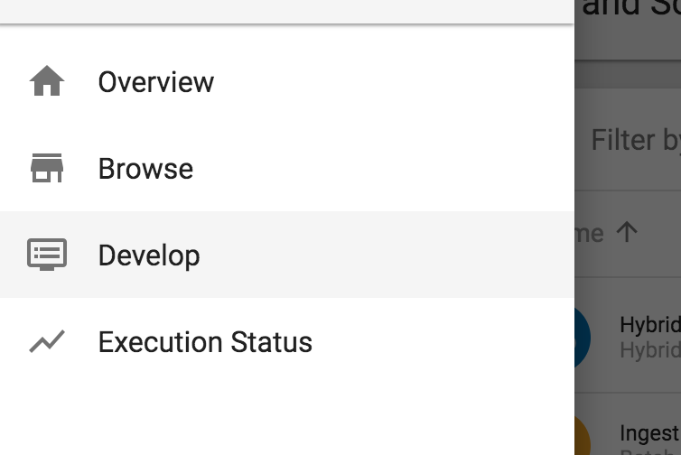

3. In the top right click on `CREATE`

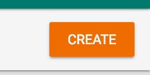

4. Create an App and make sure to note the name you use, for example `mycontainerapp`

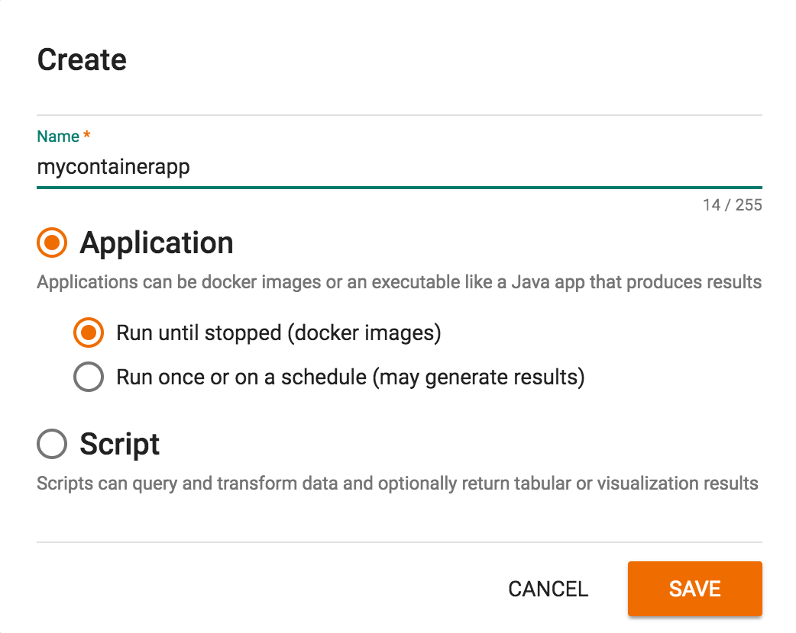

5. In the left navigation panel click on `App Container`

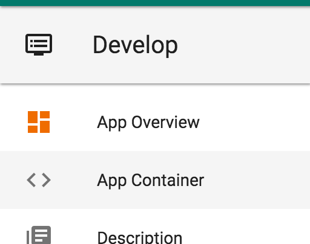

6. In the App Container section use the same values from above in the form, for example:

Registry: `quay.ac.uda.io`

Image: `<username>/appcenter-app-covalent`

Tag: `mytag`

#### Skip this set if you set your Quay settings to Make Public

Optional:

Username: (Username to the repository)

Password: (Password to the repository)

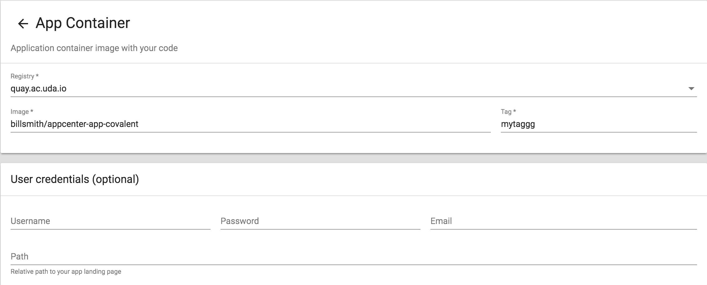

7. In the top right click `Save`

8. Wait for the image to upload to Appcenter

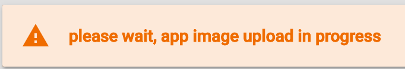

9. See that the Upload completes successfully

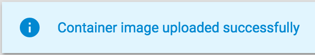

10. Under Latest Version make sure to change the port to 8080 (the default port used in this example)

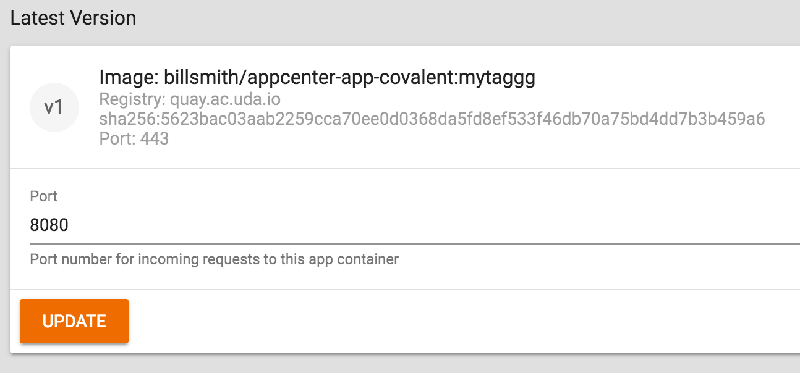

11. Click `UPDATE` to set the Port to 8080

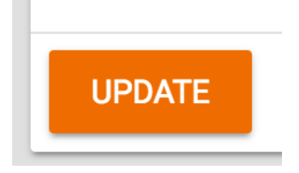

12. In the top right card click the `Start` button

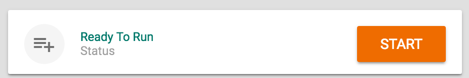

13. In the top right toolbar click the `Open` button

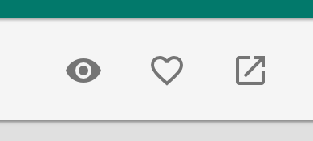

---

#### Build Docker Locally Only

(Use this if to build the container but not have it pushed to a repository like above)

1. `npm run docker:build`
2. Docker container is built locally, run command `docker images` and see it listed
3. You can run commands locally now like:
 * docker run -e APPCENTER_BASE_URL=https://appcenter.ps.ac.uda.io -p 49160:8080 -d \<username\>/appcenter-app-covalent
 (Replace https://appcenter.ps.ac.uda.io if using a different Appcenter backend)
 * docker exec -it \<container id\> /bin/bash

---
